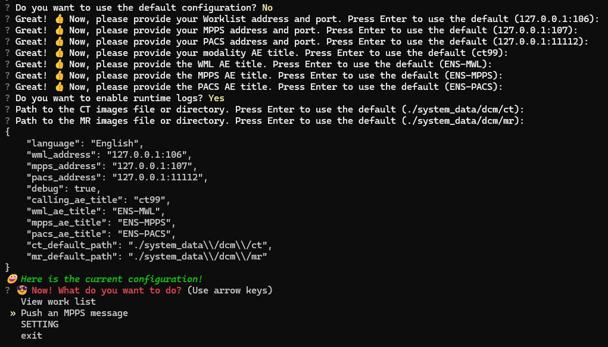

# DICOM Device Simulator

This project is a DICOM device simulator implemented in Python, utilizing the `questionary`, `pydicom`, and `pynetdicom` libraries. It provides functionalities to interact with DICOM servers, handle PACS information, and manage general settings via a command-line interface.

note1: This project is still under development.
note2: python main.py need in cmd or powershell.not in vscode or other IDE.

quick run:

```sh
 python main.py
```

## Table of Contents

- [Installation](#installation)
- [Usage](#usage)
- [Features](#features)
- [Configuration](#configuration)

### Maintainers



### MPPS Messages

- **MPPS**: Modality Performed Procedure Step (MPPS) is a DICOM data structure that contains information about the procedures performed during a study. It is used to track the progress of a patient's treatment plan and to ensure that the correct procedures are performed.


- You can choose a directory or a file. Continuous use '/'


### SEND TO PACS

- **CT**: CT is a type of medical imaging modality that uses X-ray beams to create detailed images of the body. It is used to diagnose and treat diseases and conditions such as cancer, heart disease, and lung diseases.

- **MR**: MR is a type of medical imaging modality that uses magnetic resonance to create detailed images of the body. It is used to diagnose and treat diseases and conditions such as cancer, heart disease, and lung diseases.

- **PACS**: PACS is a type of medical imaging modality that uses a network of computers to store, retrieve, and manage medical images. It is used to store, retrieve, and manage medical images.


## Installation

### Prerequisites

- Python 3.8 or higher
- Virtual environment (recommended)

### Step-by-Step Guide

1. **Clone the Repository:**

   ```sh
   git clone git@github.com:riusky/dicom-device-simulator.git
   cd irt-dicom-device-simulator
   ```

2. **Create a Virtual Environment:** unnecessary

   ```sh
   python3 -m venv venv
   ```

3. **Activate the Virtual Environment:** unnecessary

   - On Windows:

     ```sh
     .\venv\Scripts\activate
     ```

   - On macOS/Linux:

     ```sh
     source venv/bin/activate
     ```

4. **Install Required Packages:**

   ```sh
   pip install -r requirements.txt
   ```

5. **Run the Simulator:**

   ```sh
   python main.py
   ```


### Dependencies

> questionary: For creating interactive command-line interfaces.
> pydicom: For working with DICOM files.
> pynetdicom: For networking with DICOM services.

## Usage

To use the DICOM device simulator, follow these steps:
Running the Simulator

```sh
source venv/bin/activate  # On Windows, use `venv\Scripts\activate`
python main.py
```

### Interactive Menu
The simulator provides an interactive menu to manage general settings and PACS information:

1. **General Settings:**

- Edit individual settings such as language, WML address, MPPS address, etc.

2. **PACS Information:**

- Add new PACS info
- Edit existing PACS info
- Delete PACS info by UUID

## Features

### General Settings Management

- Modify individual settings with real-time validation and default values.

### Settings include:

- language
- wml_address
- mpps_address
- pacs_address
- debug
- wml_ae_title
- mpps_ae_title
- calling_ae_title
- pacs_ae_title
- ct_default_path
- mr_default_path


### PACS Information Management

- Add new PACS info with unique name validation and UUID generation.
- Edit existing PACS info with unique name validation and non-editable UUID.
- Delete PACS info by UUID.

## Configuration

- Default Configuration

The default configuration is stored in a JSON file. Example:

```json
{
    "language": "English",
    "wml_address": "127.0.0.1:106",
    "mpps_address": "127.0.0.1:107",
    "pacs_address": "127.0.0.1:11112",
    "debug": false,
    "wml_ae_title": "ENS-MWL",
    "mpps_ae_title": "ENS-MPPS",
    "calling_ae_title": "ct99",
    "pacs_ae_title": "ENS-PACS",
    "ct_default_path": "./system_data\\/dcm\\/ct",
    "mr_default_path": "./system_data\\/dcm\\/mr",
    "pacs_info": [
        {
            "name": "MIM1",
            "pacs_address": "127.0.0.1:11112",
            "pacs_ae_title": "ENS-PACS",
            "uuid": "uuids1"
        },
        {
            "name": "MIM2",
            "pacs_address": "127.0.0.1:11112",
            "pacs_ae_title": "ENS-PACS",
            "uuid": "uuids2"
        },
        {
            "name": "MIM3",
            "pacs_address": "127.0.0.1:11112",
            "pacs_ae_title": "ENS-PACS",
            "uuid": "uuids3"
        }
    ]
}

```

## Run PACS SCP

### 1. use python script

```sh
python -m pynetdicom storescp 11112 -d -aet ENS-PACS -od ./images
```

### 2. There are other ways of course

> download the microdicom and run it.

[microdicom](https://www.microdicom.com/downloads.html)


tool > Options > DICOM Servers:


## License

This project is licensed under the MIT License. See the LICENSE file for more details.

## Contributing
Contributions are welcome! Please open an issue or submit a pull request for any bugs, improvements, or new features.


For any questions or suggestions, please reach out to riusky@163.com.